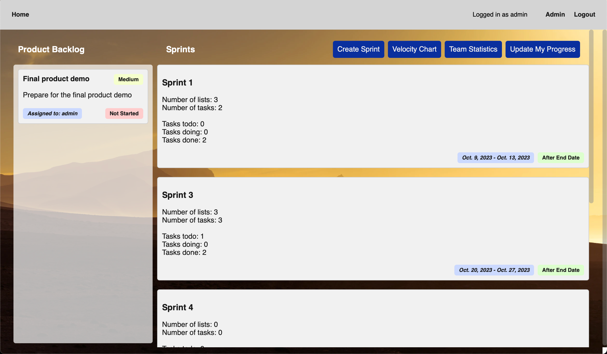
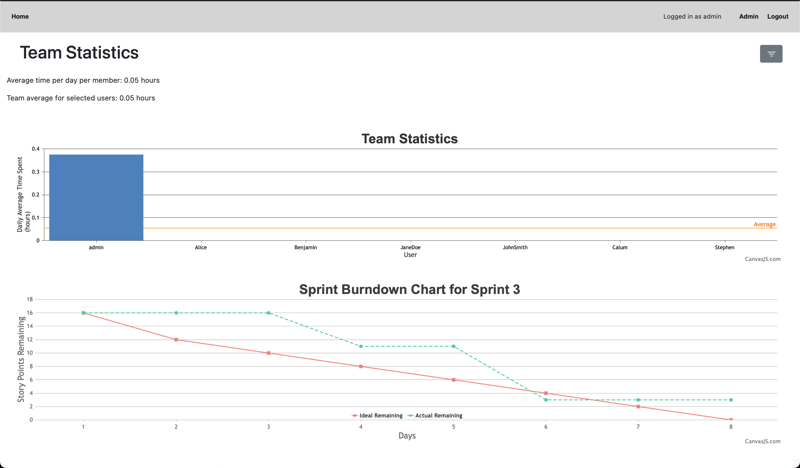
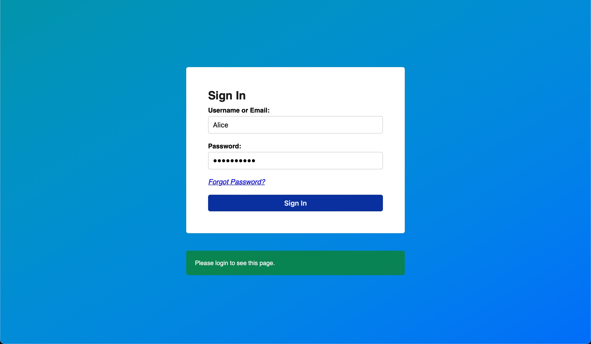

# Scrummer
- This is a copy of the original repo from gitlab
- Link to live website: https://fit2101-scrummer.vercel.app/login/

#### Home Screen

#### Performance Monitoring Page

### Login

Project Members:
- David Batonda
- Josh Van Der Veen
- Zhijun Chen
- Michelson Fu
- Azab Azab
- Oliver Joske

Demo User Credentials:
- Username: `Alice`
- Password: `E9vMzu36hu`

Demo Admin Credentials:
- Username: `admin`
- Password: `admin`
- [User Login Page](https://fit2101-scrummer.vercel.app/login/?next=/) (assuming you are not logged in)

Product Owner: Sajal Rastogi

## Old README.md (slightly modified)

## Installation

1. Clone the repository: `git@github.com:dtonda8/Scrummer.git`
2. Navigate to the project directory: `cd project`
3. (Optional) Create and Activate a virtual environment: `python -m venv venv` and `source venv\bin\activate`
4. Install the requirements (assuming you have pip installed):
`pip install -r requirements.txt` 

## To Run

-   run `python manage.py runserver` in the terminal in the root directory

## Create admin user

-   run `python manage.py createsuperuser` and then enter your details

## If you make changes to the model/database

-   run `python manage.py makemigrations [app]` to update and store as migration
-   run `python manage.py runserver` to apply migration operations

## If you want to enable password reset feature

1. Create an .env file in the scrummer folder if you haven't already
2. Obtain code from [REMOVED] and paste it into the .env file

## Notes

- Slippery Slope is Azab
- SomeGithubNoob is Josh